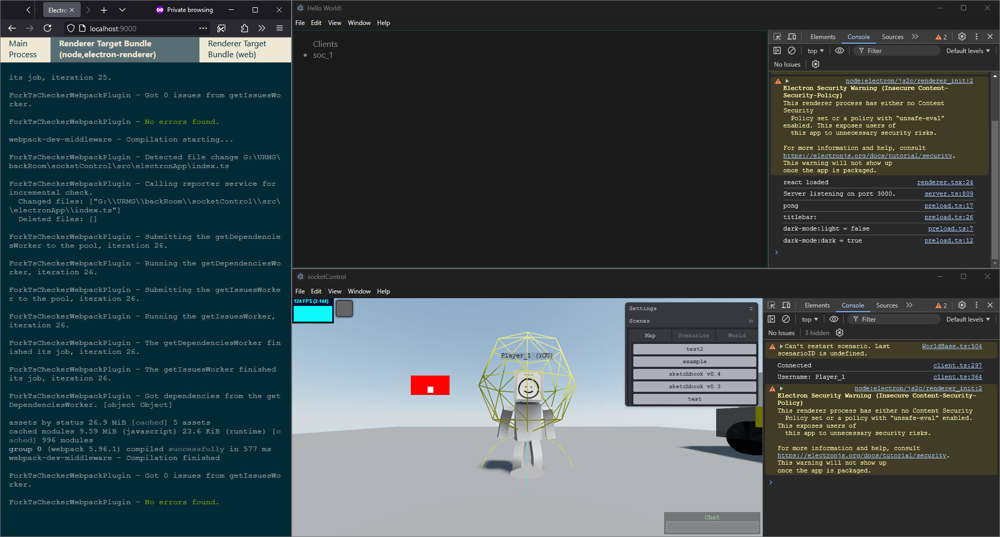

# Multiplayer Game

|                    Demo                     |                   Demo Debug                    |
| :-----------------------------------------: | :---------------------------------------------: |
|          |  |
|                  Player 1                   |                    Player 2                     |
|  |      |

    				Electron Forge Server and Client



**Multiplayer Game** is a real-time, browser-based 3D game built with [Three.js](https://threejs.org/), [Cannon-es](https://github.com/pmndrs/cannon-es), and [Socket.io](https://socket.io/). This project demonstrates how to create an interactive multiplayer environment where players can connect, interact, and compete within a dynamic 3D world.

## Features

-   **Real-time Multiplayer**: Connect multiple players in real-time using Socket.io, enabling seamless interactions and gameplay across the globe.
-   **3D Graphics**: Powered by Three.js, the game features smooth 3D rendering with support for complex geometries, lighting, and textures.
-   **Physics Engine**: Integrates Cannon-es to simulate realistic physics, allowing for dynamic interactions and collisions between objects.
-   **Interactive Environment**: Players can move, jump, and interact with various objects in the game world.
-   **Cross-Platform Compatibility**: Play directly in your browser with no need for downloads or installations.

## Base Source Code

This project is based on the source code from swift502/[Sketchbook](https://github.com/swift502/Sketchbook) v0.4. The base code provided a solid foundation for building the mechanics and 3D environment.

# Requirements

-   Node.js v19 or higher (Using Node v22.11 as of now)

# Installation

```
// to install
npm install

// to build
npm run build

// start server
npm run start:server

// start electron server (electron-forge)
npm run start

// start server on development
npm run dev
```

# Quick Install & Build then Run

-   `npm run setup`
-   `npm run start:server`
    #### `http://localhost:3000`

# Technologies Used

-   **Three.js**: For rendering 3D graphics.
-   **Cannon-es**: For physics simulation.
-   **Socket.io**: For real-time, bidirectional communication between clients and server.
-   **Node.js & Express**: Backend server setup.

### Features

#### 14th November 2023

-   Electron-Forge - { start, package, make }
    -   Used Electron-Forge Webpack-Typescript Template, Modified Webpack Plugin (./src/plugin-webpack)
-   Client and Electron Server Window (Work in progress)
    -   Server Logging in Server Window
    -   Server Debugging in Server Window (Comming soon)
-   Started React Integration

#### Till now

-   Offline and Multiplayer (Join)
-   Multiple World Maps with Different Scenarios
-   Chat (No Previous data yet)
-   Socket.io, WebSocket Communication (any one)
-   Replay: Enter `/replay` in chat to replay the game (past 15s inside world room)
-   Audio (Just Implemented as world object at origin for now)

### Todo

-   Loadout Page
-   Fix Few Syncing issues in client
-   Cannon-es to Rapier.js (Comming soon)
-   Remove Physics and Debug Related from Client and Show in Server Window

## Contributing

Contributions are welcome! If you have ideas, feature requests, or bug reports, please open an issue or submit a pull request.
